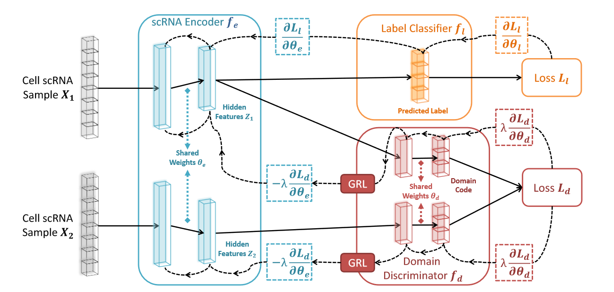
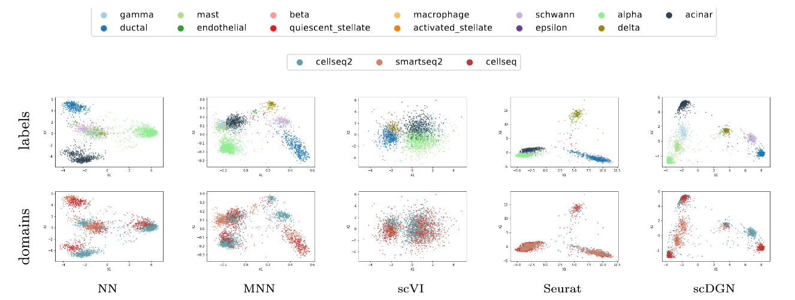
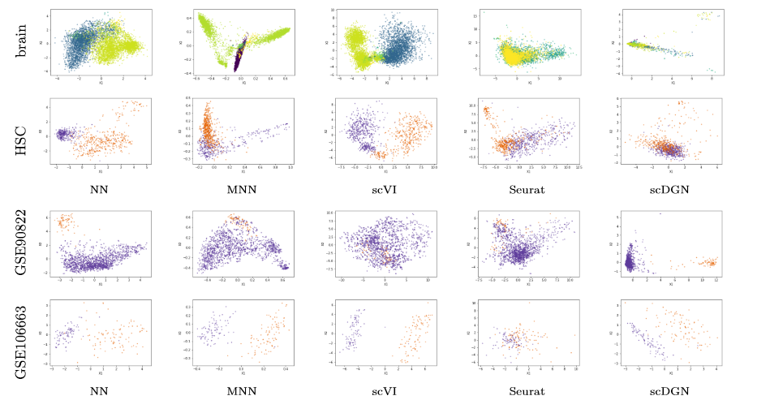

# Supervised Adversarial Alignment of Single-Cell RNA-seq Data

The scDGN model aims at reducing dimensionality for scRNA data with a kind taking care of the batch effects under supervised setting using conditional adversarial domain training.

## Pre-requisites
* PyTorch
* NumPy
* Scipy
* tqdm

## Network Architecture

Architecture of scDGN. The network includes three modules: scRNA encoder (blue), label classifier (orange) and domain discriminator (red). Note that the red and orange networks use the same encoding as input. Solid lines represent the forward direction of the neural network while the dashed lines represent the backpropagation direction with the corresponding gradient it passes. Gradient Reversal Layers (GRL) have no effect in forward propagation, but flip the sign of the gradients that flow through them during backpropagation. This allows the combined network to simultaneously optimize label classification and attempt to "fool" the domain discriminator. Thus, the encoder leads to representations that are invariant to the different domains while still distinguishing cell types.



## Preparation 

First, create the enviroment with Anaconda. Installing Pytorch with the other versions of CUDA can be found at [Pytorch document](https://pytorch.org/get-started/previous-versions/). Here PyTorch 1.0.1 and CUDA 9.0 are used:
```
  mkdir scDGN scDGN/data scDGN/ckpts
  cd scDGN
  git clone git@github.com:SongweiGe/scDGN.git
  conda create -n scDGN python=3.6
  conda activate scDGN
  conda install pytorch=1.0.1 cuda90 -c pytorch
```

Then download the `data/` folder from the link https://drive.google.com/drive/folders/1HUUT_g-uPHlLDnZS44CylH1i3DrawAsI?usp=sharing to directory `scDGN/data/`. 

## Usage

### Training
Change the `-o` to whatever you want to call. Also see run_scDGN.py to adjust hyper-parameters (for example, change `l` to control the trade-off between domain invariance and classification accuracy, `dn` indicates the name of dataset, `m` represents  margin in the contrastive loss, `adv` indicates if we use scDGN or NN, use `validation` to do hyperparameters selection with a validation set.). 
```
python run_scDGN.py -dn pancreas1 -l 0.1 -m 1 -g 0 -adv 0 -o pancreas1_test_NN --validation 0
```

### Evaluation
For inferring and visualizing the representations for NN and scDGN models. Please refer to Jupyter Notebook PCA_visualization.ipynb. Specifically, use `plot_pca_all` to plot the full dataset as below.



Note that it would be hard to visualize the whole scquery dataset in one image due to the large number of cell types and batches. You can plot for certain batches and cell types with `plot_pca_ct` or `plot_pca`.



For selecting the important genes identified by the models Please refer to Jupyter Notebook feature_importance.ipynb.
